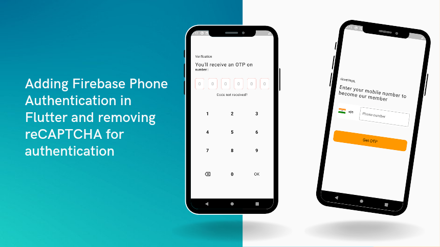

# Firebase Phone Authentication in Flutter

Firebase provides a variety of tools at one place to nourish your app such as authentication of users, cloud storage, cloud database, deep analytics of the app etc.
So, among these services I have used phone authentication service provided by firebase in this project.

### Features
##### 1) Inputting phone number with option to choose country code
##### 2) Pincode field design for entering OTP
##### 3) Resend the OTP

### A detailed explanation of this project and removing reCAPTCHA screen can be found on # [this Blog](https://medium.com/@deepaklohmod6789/adding-firebase-phone-authentication-in-flutter-and-removing-recaptcha-for-authentication-38198e9a2867 "Link of Blog")
